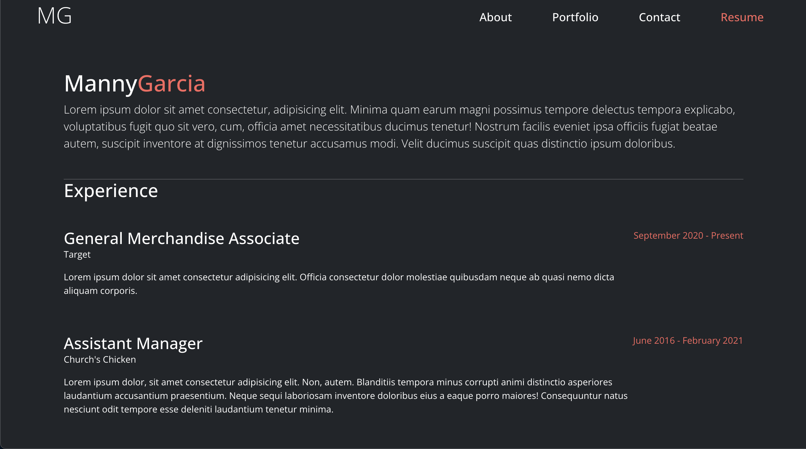

  

![license-badge]

  <h1 align="center">React Portfolio</h1>

  <!-- TABLE OF CONTENTS -->
  

    
Table of Contents

    <ul>
      <li><a href="#description">Description</a></li>
      <li><a href="#questions">Questions</a></li>
    </ul>
  

   
  
  ## Description
  A professional portfolio built with React and Bootstrap

## Questions

Email: [Mannysg88@gmail.com](mailto:Mannysg88@gmail.com)

Github: [https://github.com/Mannygarcia98](https://github.com/Mannygarcia98)

  <!-- MARKDOWN LINKS & IMAGES -->

[license-badge]: https://img.shields.io/badge/LICENSE-MIT-brightgreen?style=plastic
